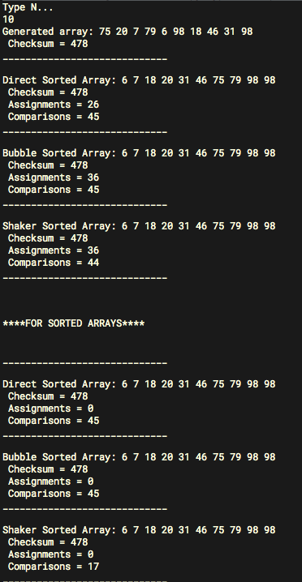

## Лабораторная работа 1

**Тема:** Методы сортировки массивов с квадратичной трудоемкостью.

**Цель работы:** Освоить методы сортировки массивов с квадратичной трудоемкостью.

**Порядок выполнения работы:**

1. Разработать процедуры сортировки массива целых чисел методом
прямого выбора, методом пузырьковой сортировки и методом
шейкерной сортировки (язык программирования Паскаль или $C$).
2. Правильность сортировки проверить путем подсчета контрольной
суммы и числа серий в массиве.
3. Во время сортировки предусмотреть подсчет количества пересылок
и сравнений ($М$ и $С$), сравнить их с теоретическими оценками.
4. Составить таблицу следующего вида (данные получить экспериментально) для $n= 10, 50, 100, 200$. ( $n$ – количество
элементов в массиве)

Метод | $М$ для упорядоченного массива | $С$ для упорядоченного массива | $М$ для случайного массива | $C$ для случайного массива |
----- | ---------------------------- | ---------------------------- | ------------------------ | ------------------------ |
Прямой выбор | 
Пузырьковая |
Шейкеровая |

**Анализ:** 

Проанализировать полученные результаты. (Какой из методов самый быстрый? Самый медленный? Как сложность зависит от начальной отсортированности?)

## Отчет

**Скриншот работы программы:**

$n=10$

Метод | $М$ для упорядоченного массива | $С$ для упорядоченного массива | $М$ для случайного массива | $C$ для случайного массива |
----- | ---------------------------- | ---------------------------- | ------------------------ | ------------------------ |
Прямой выбор | $0$ | $45$ | $26$ | $45$
Пузырьковая | $0$ | $45$ | $36$ | $45$  
Шейкеровая | $0$ | $17$ | $36$ | $44$ | 

$n=50$

Метод | $М$ для упорядоченного массива | $С$ для упорядоченного массива | $М$ для случайного массива | $C$ для случайного массива |
----- | ---------------------------- | ---------------------------- | ------------------------ | ------------------------ |
Прямой выбор | $0$ | $1225$ | $240$ | $1225$
Пузырьковая | $0$ | $1225$ | $1202$ | $1225$  
Шейкеровая | $0$ | $97$ | $1202$ | $994$ | 

$n=100$

Метод | $М$ для упорядоченного массива | $С$ для упорядоченного массива | $М$ для случайного массива | $C$ для случайного массива |
----- | ---------------------------- | ---------------------------- | ------------------------ | ------------------------ |
Прямой выбор | $0$ | $4950$ | $584$ | $4950$
Пузырьковая | $0$ | $4950$ | $5084$ | $4950$  
Шейкеровая | $0$ | $197$ | $5084$ | $4004$ | 

$n=200$

Метод | $М$ для упорядоченного массива | $С$ для упорядоченного массива | $М$ для случайного массива | $C$ для случайного массива |
----- | ---------------------------- | ---------------------------- | ------------------------ | ------------------------ |
Прямой выбор | $0$ | $19900$ | $1462$ | $19900$
Пузырьковая | $0$ | $19900$ | $20748$ | $19900$  
Шейкеровая | $0$ | $397$ | $20748$ | $15895$

**Вывод:** 

При случайном массиве, самый быстрый метод сортировки – ` Метод прямого выбора`. Самый медленный – `Пузырьковая`.

При упорядоченном массиве, самый быстрый метод сортировки – `Метод Шейкера`. Самый медленный – `Пузырьковая == Прямой выбор`.