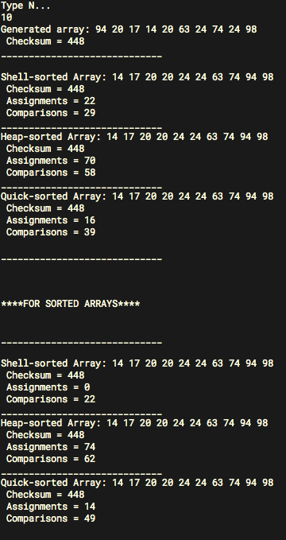

## Лабораторная работа 2

**Тема:**
Быстрые методы сортировки массивов

**Цель работы:** Освоить быстрые методы сортировки массивов

**Порядок выполнения работы:**

1. Разработать процедуры сортировки массива целых чисел
методом Шелла, методом пирамидальной сортировки и методом
Хоара (язык программирования Паскаль или $C$).
2. Правильность сортировки проверить путем подсчета
контрольной суммы и числа серий в массиве.
3. Во время сортировки предусмотреть подсчет количества
пересылок и сравнений ($М$ и $С$), сравнить их с теоретическими оценками.
4. Составить таблицу следующего вида (данные получить экспериментально) для $n=10, 50, 100, 200.$ ( $n$ – количество элементов в массиве)

Метод | $М$ для упорядоченного массива | $С$ для упорядоченного массива | $М$ для случайного массива | $C$ для случайного массива |
----- | ---------------------------- | ---------------------------- | ------------------------ | ------------------------ |
Метод Шелла | 
Пирамидальная сортировка |
Метод Хоара |

5. Проанализировать полученные результаты. (Какой из методов самый быстрый? Самый медленный? Как сложность зависит от начальной отсортированности?)
6. Сравните трудоемкости методов быстрой сортировки и трудоемкости методов с квадратичной трудоемкости (использовать результаты лабораторной работы 1)

## Отчет

**Скриншот работы программы:**

$n=10$

Метод | $М$ для упорядоченного массива | $С$ для упорядоченного массива | $М$ для случайного массива | $C$ для случайного массива |
----- | ---------------------------- | ---------------------------- | ------------------------ | ------------------------ |
Метод Шелла | $0$ | $22$ | $22$ | $29$ |
Пирамидальная сортировка | $74$ | $62$ | $70$ | $58$ |
Метод Хоара | $14$ | $49$ | $16$ | $30$ |

$n=50$

Метод | $М$ для упорядоченного массива | $С$ для упорядоченного массива | $М$ для случайного массива | $C$ для случайного массива |
----- | ---------------------------- | ---------------------------- | ------------------------ | ------------------------ |
Метод Шелла | $0$ | $203$ | $304$ | $335$ |
Пирамидальная сортировка | $620$ | $540$ | $566$ | $518$ |
Метод Хоара | $540$ | $1008$ | $132$ | $333$ |

$n=100$

Метод | $М$ для упорядоченного массива | $С$ для упорядоченного массива | $М$ для случайного массива | $C$ для случайного массива |
----- | ---------------------------- | ---------------------------- | ------------------------ | ------------------------ |
Метод Шелла | $0$ | $503$ | $698$ | $808$ |
Пирамидальная сортировка | $1472$ | $1288$ | $1354$ | $1232$ |
Метод Хоара | $1288$ | $2982$ | $332$ | $814$ |

$n=200$

Метод | $М$ для упорядоченного массива | $С$ для упорядоченного массива | $М$ для случайного массива | $C$ для случайного массива |
----- | ---------------------------- | ---------------------------- | ------------------------ | ------------------------ |
Метод Шелла | $0$ | $1203$ | $1790$ | $2009$ |
Пирамидальная сортировка | $3366$ | $2998$ | $3094$ | $2846$ |
Метод Хоара | $280$ | $8678$ | $720$ | $2555$ |

**Вывод:**

При случайном массиве, самый быстрый метод сортировки – `Метод Хоара`. Самый медленный – `Пирамидальная сортировка`.

При упорядоченном массиве, самый быстрый метод сортировки – `Метод Шелла`. Самый медленный – `Пирамидальная сортировка`.

При сравнении с Лабораторной №1 – все методы быстрой сортировки быстрее, чем  методы сортировки массивов с квадратичной трудоемкостью.