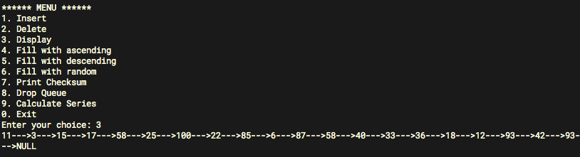

## Лабораторная работа 3

**Тема:**
Работа с линейными списками

**Цель работы:** Освоить основные операции с линейными сприсками

**Порядок выполнения работы:**

1. Разработать процедуры для работы со списками (язык программирования Паскаль или $C$):
  * заполнение стека и очереди возрастающими числами; 
  * заполнение стека и очереди убывающими числами.
  * заполнение стека и очереди случайными числами;
  * печать элементов списка;
  * подсчет контрольной суммы элементов списка;
  * подсчет количества серий в списке.
2. Применить разработанные процедуры для $n=20$ ( $n$ – количество
элементов в списке).
3. Проанализировать полученные результаты. (Какой порядок
элементов в стеке? В очереди? Зависит ли количество серий от вида списка?)

## Отчет

**Скриншот работы программы:**

**Вывод:**

Стек - "LIFO" (last in first out) data structure. Элемент который добовляется последним, извлекается первым.

Очередь - "FIFO" (first in first out) data structure. Элемент который добавляется последним, извлекается последним.

Количество серий зависит от того, как расположены элементы. Например в списке по убыванию будет столько серий, сколько в этом списке элементов. А в списке по возрастанию – будет всего 1 серия.
