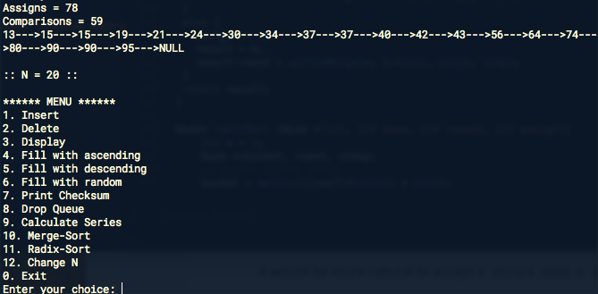

## Лабораторная работа 4

**Тема:**
Быстрые методы сортировки последовательностей

**Цель работы:** Освоить быстрые методы сортировки последовательностей

**Порядок выполнения работы:**

1. Разработать процедуры сортировки последовательности целых чисел методом прямого слияния и методом цифровой сортировки (язык программирования Паскаль или $C$).
2. Во время сортировки предусмотреть подсчет количества пересылок элементов в очередь и сравнений ($М$ и $С$), сравнить их с теоретическими оценками.
3. Составить таблицу следующего вида (данные получить экспериментально) для $n=10, 50, 100, 200.$ ( $n$ – количество элементов в массиве)

Метод | $М$ для упорядоченной последовательности | $С$ для упорядоченной последовательности | $М$ для случайной последовательности | $C$ для случайной последовательности |
----- | ---------------------------- | ---------------------------- | ------------------------ | ------------------------ |
Прямое слияние | 
Цифорвая |

**Анализ:**

1. Проанализировать полученные результаты. (Какой из методов самый быстрый? Самый медленный? Как сложность зависит от начальной отсортированности?)

##Отчет

**Скриншот работы программы:**

**Таблица для N элементов:**

$n=10$

Метод | $М$ для упорядоченной последовательности | $С$ для упорядоченной последовательности | $М$ для случайной последовательности | $C$ для случайной последовательности |
----- | ---------------------------- | ---------------------------- | ------------------------ | ------------------------ |
Прямое слияние | 28 | 19 | 33 | 24 
Цифорвая | 40 | 0 | 40 | 0

$n=50$

Метод | $М$ для упорядоченной последовательности | $С$ для упорядоченной последовательности | $М$ для случайной последовательности | $C$ для случайной последовательности |
----- | ---------------------------- | ---------------------------- | ------------------------ | ------------------------ |
Прямое слияние | 202 | 153 | 276 | 227 
Цифорвая | 200 | 0 | 200 | 0

$n=100$

Метод | $М$ для упорядоченной последовательности | $С$ для упорядоченной последовательности | $М$ для случайной последовательности | $C$ для случайной последовательности |
----- | ---------------------------- | ---------------------------- | ------------------------ | ------------------------ |
Прямое слияние | 455 | 356 | 641 | 542 
Цифорвая | 400 | 0 | 400 | 0

$n=200$

Метод | $М$ для упорядоченной последовательности | $С$ для упорядоченной последовательности | $М$ для случайной последовательности | $C$ для случайной последовательности |
----- | ---------------------------- | ---------------------------- | ------------------------ | ------------------------ |
Прямое слияние | 1011 | 812 | 1475 | 1276 
Цифорвая | 800 | 0 | 800 | 0

**Вывод:**

При случайном списке, самый быстрый метод сортировки – `Цифровая`.
При упорядоченном списке, самый быстрый метод сортировки – `Цифровая`.

Цифровая сортировка получается быстрее из-за количества разрядов в числе (2).