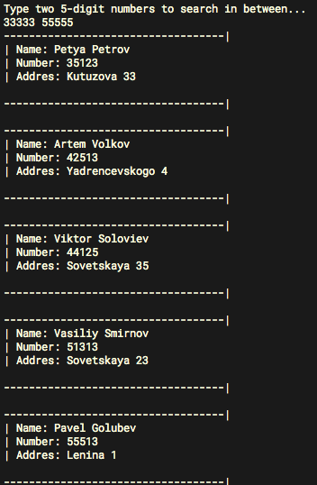

## Лабораторная работа 5

**Тема:** Индексация и быстрый поиск

**Цель работы:** Освоить методы построения индексных массивов и быстрого
поиска в массиве.

**Порядок выполнения работы:**

Написать программу «Телефонный справочник», которая обрабатывает данные об абонентах телефонной станции. Каждый абонент имеет имя, адрес, телефонный номер. В программе описать массив абонентов (назовем его справочник). В справочнике должно быть не менее 20 элементов, которые заполняются либо программно, либо считываются из файла.
С помощью индексов и фильтров (номер задания выбирается по последней цифре шифра)

+ **3** – Выбрать тех абонентов, которые имеют номер в заданном диапазоне.

##Отчет

**Скриншот работы программы:**

